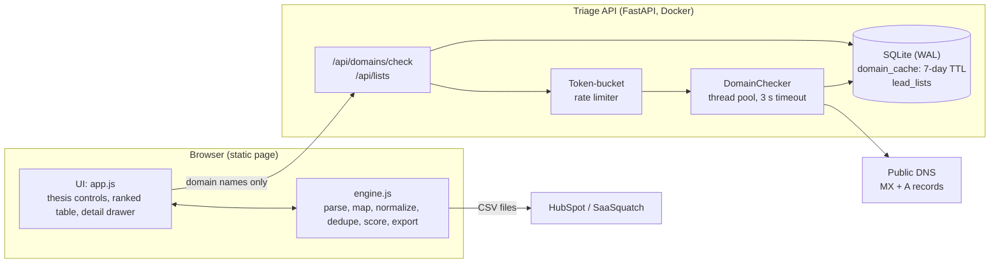

# Triage for SaaSquatch

**Rank a SaaSquatch lead export before you spend enrichment credits.**

Triage takes a raw lead export (SaaSquatch or any CSV), cleans it, validates every contact, and scores each company against a thesis you control. It then sorts the list into four next steps: who to **contact now**, which strong fits are **worth a credit to enrich**, what to **hold**, and what to **skip**. Every score shows exactly why it is what it is.

!(docs/ranked-list.png)

---

## The problem this solves

SaaSquatch's users are mostly searchers and small sales teams sourcing owner-operated, lower-middle-market businesses. The workflow is: scrape a few hundred companies, then spend credits to unlock owner emails and phones, then reach out. Two things go wrong in that middle step.

1. **Credits go to the wrong companies.** A scraped list for "HVAC in Ohio" includes $200K one-truck shops, $80M regional players, and businesses that closed last year. Enriching all of them wastes most of the credits. SaaSquatch's own pitch is that you can *enrich only the leads you want*, but nothing tells you which ones those are.
2. **Raw exports are messy.** The same business appears three times (`www.` vs `https://`, `LLC` vs `Inc.`, a different contact each time). Some emails are malformed, some are `info@` inboxes nobody reads, and some domains have no mail server. Reps find out by bouncing.

Triage sits between *scrape* and *enrich*. On the bundled 158-row sample in acquisition mode, it:

- merges 18 duplicate rows into 140 companies and flags 8 malformed or disposable emails;
- finds **47** strong-fit companies you can reach today without spending anything;
- finds **30** strong fits that genuinely need enrichment, out of 74 companies with no reachable person, so you **spend 30 credits instead of 74**.

(The sample's domains are invented, so mail-server checks are skipped for it. On a real export, the API also catches addresses on domains that cannot receive mail.)

## What it does

| Step | What happens | Why it matters for outreach |
|---|---|---|
| **Map** | Detects columns from 17 canonical fields using header synonyms (`Business Name`, `Est. Revenue`, `# of Employees`…), then shows the mapping with sample values so you can fix it. | Exports change. A new column name should not break the tool. |
| **Clean** | Normalizes URLs to domains, tidies ALL-CAPS names, and parses revenue (`$1.2M`, `1,250,000`, `1-5M`, `<$1M`) and headcount (`11-50`, `500+`) into numbers. | You can't filter on a revenue band if half the column is text. |
| **Dedupe** | Matches on domain, then name + state, then a typo-tolerant name match (Dice bigrams ≥ 0.88 *and* a matching distinctive first word). It keeps the most senior contact and the best email from all copies. | No double outreach. No lost data from the duplicate that happened to have the owner's email. |
| **Validate** | Classifies emails as malformed, disposable, shared inbox (`info@`, `office@`), personal, or direct on the company domain. Validates US/NANP and international phones. The API adds **DNS + MX checks** per domain. | A well-formed address on a domain with no mail server will still bounce. |
| **Score** | Seven weighted factors: revenue fit, team-size fit, operating history, industry fit, recurring revenue, decision-maker contact, and reachability. Two presets (acquisition sourcing, sales outreach), and every number is editable. Re-ranks live as you drag. | Ranking is only useful if it matches *your* thesis and you can see why. |
| **Act** | Queues leads into *Contact now* / *Enrich first* / *Hold* / *Skip*. Includes a per-lead first-touch message from an editable template, and three exports: HubSpot-ready contacts, the enrichment queue, and the full ranked list. | Ends in the CRM, not in another spreadsheet. |

### How the score works

Each factor returns a value from 0 to 1. Your weights are normalized to 100 points, so the factor bars in the detail view always sum to the score. Missing data earns partial credit (0.35). An unknown company ranks below a confirmed fit but above a confirmed misfit, so thin records don't get buried or promoted by accident.

| Factor | Logic |
|---|---|
| Revenue fit / team size fit | Full marks inside your band; falls off on a log scale and reaches 0 at 4× outside it. |
| Operating history | Full marks at 2× your minimum years; 0.8 at the minimum; linear below. |
| Industry fit | Raw scraper industries map into six groups (home services, B2B services, IT, healthcare services, industrial, consumer). In scope = 1, out of scope = 0.1. |
| Recurring revenue | Keyword signal for service-contract and subscription businesses (pest control, managed IT, payroll, HVAC service…). Weighted in acquisition mode, off in sales mode. |
| Decision-maker contact | Owner / founder / president > executive > director > manager > staff. A VP is not mistaken for a president. |
| Reachability | Direct email on the company domain > other direct > personal > shared inbox. A phone counts more when we know whose it is. Penalized when the API says the domain doesn't resolve. |

**Tiers:** A ≥ 80, B ≥ 65, C ≥ 45, D below. **Queues:** A/B with a person-level channel → *Contact now*; A/B without one → *Enrich first*; C → *Hold*; D, or no domain and no contact → *Skip*. A company main line with no name attached does **not** count as reachable. That is exactly the gap a SaaSquatch credit fills.

## Architecture



**Why the engine runs in the browser.** Scoring is pure CPU over a few thousand rows. Running it client-side means a slider drag re-ranks in a single frame with no network round trip. It also means the lead file itself never leaves the user's machine, which matters when the file contains personal contact data. The server only does what a browser can't: DNS/MX lookups and durable storage. The same `engine.js` is loaded by Node for the test suite, so there is one implementation, not two.

**Why there is still a backend.** Browsers cannot resolve MX records. Without them, "valid email" only means "well-formed", and the bounce rate stays the same.

### Stack

| Layer | Choice | Notes |
|---|---|---|
| Frontend | Vanilla JS (ES2020), HTML, CSS custom properties | No framework or build step needed to develop. `scripts/build.py` inlines everything into one 120 KB `dist/index.html` for static hosting. Light/dark themes, keyboard navigation, responsive down to 360 px. |
| Font | Schibsted Grotesk (Google Fonts) | Tabular numerals for scores; full system-font fallback. |
| API | Python 3.12, FastAPI 0.115, Uvicorn, Pydantic v2 | Request validation via Pydantic (batch ≤ 500 domains, list ≤ 20k leads). GZip middleware. CORS is configurable. |
| DNS | dnspython 2.7 | Real MX answers. Falls back to `socket.getaddrinfo` (A record only) if dnspython is missing. |
| Database | SQLite in WAL mode | Two tables: `domain_cache` and `lead_lists`. One connection per thread. All SQL lives in `Store`, so moving to Postgres means rewriting one class. |
| Tests | `node:test` (18 engine tests), `unittest` (8 backend tests) | Runs in CI on every push. No network needed: DNS is injected. |
| Packaging | Docker (python:3.12-slim, non-root, healthcheck) | |
| CI/CD | GitHub Actions | `ci.yml` runs tests; `pages.yml` builds and deploys the static page to GitHub Pages. |

### Caching and performance

- **Domain cache.** Conclusive DNS answers are cached in SQLite for 7 days. Small-business DNS rarely changes, and re-importing the same export costs zero lookups. Timeouts are *not* cached, so a flaky resolver gets retried next time.
- **Concurrent lookups.** Cache misses fan out over a 16-thread pool with a per-lookup timeout, so one dead nameserver can't stall a batch. The frontend sends batches of 200 and re-ranks after each one, so results appear progressively.
- **Rate limiting.** A per-client token bucket (burst 20, then 2 requests/s) on write endpoints keeps one user from hammering public resolvers.
- **Scoring speed.** Measured in Node 22: a 140-company list scores in under 20 ms; 10,000 leads in roughly 0.2–0.35 s. Dedupe of a 6,500-row file takes about 200 ms. Fuzzy matching is blocked by first three letters + state, so it doesn't go quadratic. Slider input is coalesced with `requestAnimationFrame`, and the table renders 100 rows at a time.

### Hosting and deployment

| Piece | Where | Type |
|---|---|---|
| Frontend | **GitHub Pages** (free CDN), via `.github/workflows/pages.yml` | Static. Works on its own in *offline mode* (everything except MX checks and saved lists). |
| API | **Render** web service from the `Dockerfile` (`render.yaml` blueprint), with a 1 GB disk at `/data` for SQLite | A long-running container, not serverless: the SQLite file needs a stable disk, and one small container is cheaper and simpler than functions plus a managed database at this scale. |

**Path to production at real scale (AWS):** CloudFront + S3 for the static page; the same container on ECS Fargate or App Runner behind an ALB; RDS Postgres for saved lists; ElastiCache (Redis) or a DynamoDB table with TTL for the domain cache; and the rate limiter moved to API Gateway or Redis so it works across replicas. Because all SQL lives behind the `Store` class, the application code doesn't change.

## Run it

**Just the app (no install):** open `dist/index.html` in a browser and click *Load sample export*.

**App + API locally:**

```bash
cd backend
python -m venv .venv && source .venv/bin/activate      # Windows: .venv\Scripts\activate
pip install -r requirements.txt
uvicorn triage_api.app:app --reload
# open http://127.0.0.1:8000  (API docs at /api/docs)
```

**With Docker:**

```bash
docker build -t triage .
docker run -p 8000:8000 -v triage-data:/data triage
```

**Tests:**

```bash
node --test tests/engine.test.js                 # engine (Node 18+)
cd backend && python -m unittest discover -s tests -v
```

**Rebuild the standalone page** (after editing `frontend/`, or to point it at a deployed API):

```bash
python scripts/build.py                          # offline mode
python scripts/build.py https://your-api.onrender.com
```

**Deploy:**

1. Push to GitHub. Under *Settings → Pages*, set *Source* to *GitHub Actions*. The `pages` workflow publishes `dist/` on each push to `main`.
2. Optional API: on Render, choose *New → Blueprint* and pick this repo (`render.yaml`). Set `TRIAGE_CORS_ORIGINS` to your Pages URL. Then add a repo variable `TRIAGE_API_BASE` with the Render URL and re-run the `pages` workflow.

### API

| Method | Path | Body / result |
|---|---|---|
| GET | `/api/health` | `{ ok, dns_mode: "mx" \| "a-record", cache_ttl_days }` |
| POST | `/api/domains/check` | `{ domains: [...≤500] }` → `{ results: { domain: { resolves, has_mx, source: "cache" \| "live" } }, invalid, stats }` |
| GET | `/api/lists` | Saved lists, newest first |
| POST | `/api/lists` | `{ name, thesis, leads }` → `{ id, name, lead_count }` |
| GET / DELETE | `/api/lists/{id}` | Full list / remove it |

## Repository layout

```
frontend/      index.html, styles.css, app.js (UI), engine.js (all logic), config.js, sample-data.js (generated)
backend/       triage_api/ (FastAPI app, storage, domain checker, rate limiter), tests/, requirements.txt
data/          sample_leads.csv: synthetic, deliberately messy export (158 rows)
scripts/       generate_sample.py, build.py
tests/         engine.test.js
dist/          index.html: single-file build for static hosting
docs/          screenshots
```

## Data and ethics

- **Synthetic sample.** Every company, person, email and phone number in `data/sample_leads.csv` is invented. `scripts/generate_sample.py` regenerates it deterministically.
- **No new scraping.** Triage works only on an export the user already has. It never fetches personal data. The only outbound requests are DNS queries for business domains.
- **Data stays local by default.** Lead rows are processed in the browser. Only domain names go to the API, unless the user explicitly saves a list.
- **Explainable, adjustable scores.** Nothing is a black box. The user sees and controls every weight. That matters both for trust and for not quietly excluding businesses on signals nobody chose.

## Scope and what I'd build next

This was scoped to a five-hour build, so I went *quality first*: one workflow, done properly, instead of several thin tools.

Deliberately out of scope, and next in line:

1. **Write back into SaaSquatch.** Push the enrichment queue straight into SaaSquatch's enrich step and pull results back in, instead of using CSV.
2. **Native CRM sync.** HubSpot and Salesforce APIs instead of CSV import, with dedupe against records already in the CRM.
3. **Learn the weights.** Once outcomes are logged (replied, meeting, LOI), fit the weights to what actually converts.
4. **Website liveness and signals.** Fetch the homepage to confirm the business is active, and pull service lines and "family-owned since" phrases as extra scoring inputs.
5. **Postgres + auth** for team-shared lists.
